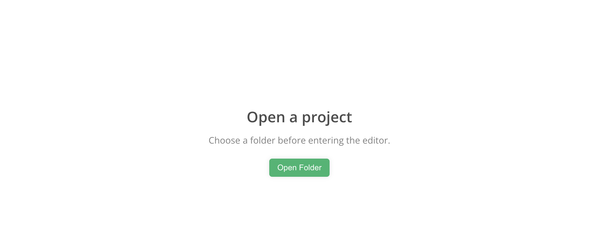

<p align="center">
  
</p>

<h1 align="center">orangeMark</h1>

<p align="center">
  <b>A project-first WYSIWYG Markdown editor.</b><br/>
  Open a folder, get a VS Code-style explorer, and write in a clean, warm, distraction-free canvas.
</p>

<p align="center">
  <a href="https://github.com/guojun21/orangeMark/stargazers"></a>
  
  
  <a href="./LICENSE"></a>
</p>

<p align="center">
  
</p>

---

## Why orangeMark

Most Markdown editors open into a floating, path-less "Untitled" buffer. orangeMark does the opposite: **every window is bound to a project folder.** You open a folder, and the whole app — the file tree, the tabs, new files — lives inside that project. No orphan documents, no "where did I save that".

It builds on the excellent open-source [MarkText](https://github.com/marktext/marktext) editor and adds a project-centric workflow, a warm minimal theme, and a VS Code-style explorer.

## Features

| | |
|---|---|
| 🗂️ **Project-first** | No path-less windows. Launch straight into a folder picker; every session is a project. |
| 🌳 **VS Code-style explorer** | Workspace root, hover actions (new file/folder, refresh, collapse-all), indent guides, active-file highlight, recent projects. |
| 🍊 **Plume theme** | An original warm-white, minimal palette tuned for long-form reading and writing. |
| ✍️ **True WYSIWYG** | Seamless live preview — no split pane. Plus source-code mode, focus mode, typewriter mode. |
| 🧮 **Math & diagrams** | KaTeX formulas, Mermaid diagrams, syntax-highlighted code blocks. |
| 🧭 **Outline & search** | Document outline (TOC) and full-project search in the sidebar. |
| 📤 **Export** | HTML / PDF export out of the box. |

## Quick start

Requires Node.js ≥ 20 and pnpm ≥ 10.

```bash
git clone https://github.com/guojun21/orangeMark.git
cd orangeMark
pnpm install

pnpm --filter marktext dev                                   # run in dev
pnpm --filter marktext exec electron-builder --mac --arm64   # package a macOS .app / .dmg
```

## Tech stack

Electron 42 · Vue 3 · Vite (electron-vite) · Pinia · the **muya** WYSIWYG engine · pnpm monorepo.

## Credits & license

orangeMark is a customization of **[MarkText](https://github.com/marktext/marktext)** (MIT License, © 2017-present Luo Ran). The upstream MIT license and copyright are preserved in full in [`LICENSE`](./LICENSE). orangeMark's additions are released under the same MIT license.

UI, theme, and icon are original work. Interaction ideas are inspired by Typora and VS Code; no copyrighted assets or source from those products are used.

---

<p align="center">
  If orangeMark helps you write, please leave a ⭐ — it genuinely helps.
</p>
